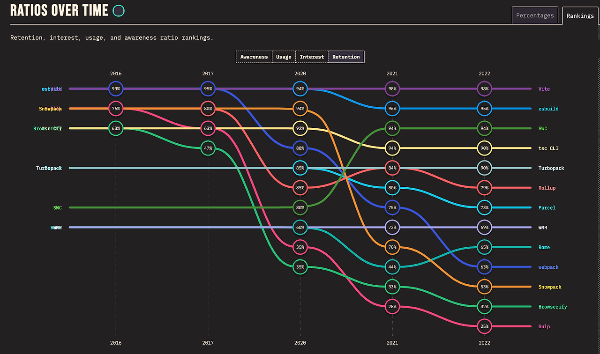

# Vite

-   `번들러 툴`
-   사전 번들링은 esbuild, 소스코드는 rollup으로 번들링 진행

## JS 모듈 시스템의 발전

> ### 모듈
>
> 코드와 데이터의 묶음
>
> Node 환경의 분리된 개별 파일 1개

### 모듈 시스템의 탄생 이전

javascript 파일은 HTML의 script 태그로 불러서 사용된다.

브라우저가 문설를 보여주기 위해서는 html을 파싱하는 단계를 거치게 된다.

이 때, HTML에서 외부 리소스를 요청하는 태그 `<link>`, `<script>`, `` 등 여러가지가 존재하지만, HTML 파싱과 렌더링에 직접 영향을 주는건 CSS, JS 두 가지이다.

JS는 HTML 파싱중 `<script>`를 만나게되면,

1. JS 파일에 대한 파싱
2. AST(추상 문법 트리)를 생성
3. 실행
4. HTML 파싱 중단점부터 이어서 실행

(현재는 async, defer 등으로 다르게 실행을 제어)

이 때, JS는 모듈 시스템이 존재하지 않았으며, 모듈 스코프 또한 존재하지 못했다.

여러개의 JS를 불러왔을 경우, 모두 같은 전역 스코프를 바라보았으며 전역 객체 오버라이딩으로 인해 예상치 못한 오류가 발생했다.

해결방법으로 즉시함수와 namespace(전역에 객체 선언후 사용)를 통해 전역 변수를 선언하지 않고 관리했으나, 완전히 해당 문제를 해결하지 못했다.

<br />

### 모듈 시스템의 발전 및 역사

```
CommonJS[ServerJS](2009) -> AMD(2009) -> UMD(2009 ~ 2010) -> ESM(2015)
```

1. CommonJS

당시 CommonJS에서는 `module.exports`, `exports` 객체를 통해 require 함수를 통해 모듈을 불러왔다.

전역 객체에 값을 할당한 뒤에, require 함수를 이용하여 해당값을 불러와서 사용했는데, CommonJS의 경우 모듈 로더가 동기적으로 작동, 모듈을 순서대로 하나씩 불러오고 처리했다.

하지만, 서버사이드 작동을 위해 고안되어 비동기로 동작하는 브라우저 환경에서 사용하기에는 무리가 있었다.

> ### 서버가 동기적으로 작동해도 괜찮은 이유
>
> 서버 어플리케이션은 파일 시스템에 직접 접근가능
> 필요한 모듈이나 데이터를 로컬에서 빠르게 로드가능
> 네트워크 지연시간이 없어 동기적인 로딩이 UX에 미치는 영향이 적었다

<br />

> ### 브라우저가 동기적으로 작동하면 안되는 이유
>
> 로컬이 아닌 네트워크를 통해 모듈, 라이브러리를 로드하기 때문에 로딩시간이 크게 증가
> 어플리케이션의 규모에 따라서 영향이 커졌다
> 브라우저 환경에서 비동기로 동작하는 모듈 시스템이 필요해졌다
> 이를 고려하여 `AMD`가 탄생했다

<br />

2. AMD(Asynchronous Module Definition)

`비동기 로드 모듈 시스템을 위한 표준`

AMD는 브라우저 환경을 위한 브라우저 모듈의 표준을 만들고자 했으며, 모듈과 의존성을 비동기적으로 로드하는 방법을 정의하는 개방형 표준을 공개

RequireJS 라이브러리를 사용하여 비동기적으로 모듈을 불러와 사용

```js
/* RequireJS */

// messages.js
define(function () {
    return {
        getHello: function () {
            return "Hello World";
        },
    };
});

// main.js
define(function (require) {
    var messages = require("./messages");
    var print = require("print");

    print(messages.getHello());
});
```

3. UMD(Universal Module Difinition)

`다양한 모듈 방식을 분기처리를 통해 관리하는 프로그래밍 패턴`

JS 생태계의 확장으로, CommonJS / AMD 모듈 시스템을 모두 지원해야 하는 상황 발생

이로 인해 모듈 관리 패턴 `UMD` 탄생

```js
(function (root, factory) {
    if (typeof define === "function" && define.amd) {
        // AMD
        define([], factory);
    } else if (typeof module === "object" && module.exports) {
        // CommonJS
        module.exports = factory();
    } else {
        // browser
        root.isDev = factory();
    }
})(this, function () {
    return process.env.NODE_ENV === "development";
});
```

4. ESM(esmodule)

`자바스크립트 모듈 표준의 등장, ECMAScript2015`

JS 자체 모듈 시스템

```js
/* package.json */
{
	"type" : "module"
}

/* html */
<script type="module" src="./test.js" />
<script type="module" src="./test.mjs" />
```

`export`, `import` 구문을 통해 내보낼 모듈과 가져올 모듈을 정의

commonJS는 module.exports 객체를 통해 모듈 정의, 객체의 특성상 재할당 등으로 인해 의존성 파악의 어려움 발생

esmodule의 경우 모듈간 의존성 파악이 명확

<br />

<br />

## 번들러

웹 생태계의 발전으로, 웹 어플리케이션의 규모가 점점 커져 관리할 파일이 증가했다.

당시 HTTP 표준 스펙은 `HTTP/1.1`이었으며, 무거운 헤더와 HOLB라는 문제를 가지고 있었다.

HOLB은 다중 요청은 가능했지만, 먼저 들어온 요청에 대한 응답이 끝나면 다음에 들어온 요청에 대한 응답을 받을 수 있었다. 앞에 있는 요청 Head에 문제가 생길 경우 뒤에 있는 요청이 블로킹 되어있는 것을 의미한다.

무거운 헤더를 가지고 있어 네트워크 요청을 최소화 해야만 했다.

파일을 하나로 합치게되는 계기가 되었다...

CSS,Font, Image, JS를 정적인 파일로 변환하고 하나로 합쳐주는 `번들러`가 탄생

### 용어

#### `Tree-Shaking`

-   사용하지 않는 불필요한 코드를 최종 빌드 결과물에서 제거하여 용량을 최적화

#### `HMR(Hot Module Replacement)`

-   코드의 수정이 발생할 경우 새로고침 없이도 바로 변경된 부분을 확인할 수 있는 개발 효율성을 크게 향상시키는 중요한 기능
-   코드의 수정이 발생하면 러나임에 이를 알리고 강제로 새로고침을 진행하는 Hot-Reloading 개념을 모듈에 적용시켜 확장한 개념으로 볼 수 있다

#### `Code-Spliting`

-   번들을 모두 하나로 통합하는 것이 아닌, lazy-loading을 통해 필요한 시점에 분리된 번들을 요청하는 식으로 번들을 나누어 개별 번들 사이즈를 줄이는 방식

### 번들러의 발전

```
Webpack(2014)

RollupJS(2015)

Parcel(2017)

Snowpack(2019)

exbuild(2020.01)

Vite(2020.04)

Webpack v5 (2020.10)

Turbopack(2022)
```

1. **Webpack**

-   JS로 구현
-   규모가 크고 복잡한 어플리케이션의 관리에 중점
-   단점
    -   높은 러닝 커브(초기 설정)
    -   많은 플러그인, 로더 구성 파일이 방대해짐
    -   오래걸리는 빌드 시간

2. **RollupJS**

`ESM 지원 번들러의 등장`

Rollup은 경량화와 번들 최적화를 중점에 둔 ESM 지원 모듈 번들러이며, exmodule이 추가되었다.

```js
/*****************/
/* CommonJS(cjs) */
/*****************/

// test.js
module.exports = "hello";

// index.js
const hello = require("./test.js");

/*****************/
/* esmoudle(mjs) */
/*****************/

// test.js
const hello = "hello";
export default hello;

// index.js
import hello from "./test.js";
```

module.exports는 객체를 통해서 관리하기 떄문에 모듈 간의 의존성 파악을 명확하게 할 수 없었으나, ESM은 import export를 통해서 모듈을 내보내고 불러오기 때문에 모듈 간의 의존성 파악을 명확하게 할 수 있다.

Rollup은 다음을 제공한다.

-   Tree-Shaking
-   Code-Spliting
-   (플러그인을 이용하면) rollup-plugin-hot을 통해 HMR 사용

번들 사이즈 `경량화`와 `최적화`에 중점을 둔 번들러로서, 라이브러리를 구현하는데에 많이 쓰임

3. **Parcel(zero-configuration)**

복잡한 설정을 하지 않아도 즉시 사용이 가능

-   장점
    -   낮은 러닝커브
    -   빠른 빌드시간
    -   HMR 기능 제공
-   단점
    -   세밀한 최적화 & 커스터 마이징에 한계
    -   캐시 관리와 멀티 코어 리소스를 효율적으로 사용하는데 어려움 존재

대규모보단 중소 프로젝트에 적합한 번들러

4. **esbuild**

`Go로 구현`되어 있어 속도가 빠르다

-   캐싱이 필요 없는 최고의 속도
-   JavaScript, CSS, TypeScript JSX 내장
-   ESM과 CommonJS 모듈 번들 지원
-   CSS모듈을 포함한 CSS번들 생성
-   Tree shaking, 번들 minification, source map 지원
-   code spliting (예정)

5. **Snowpack**

-   빠른 개발 서버를 구축하는 데 중점
-   코드의 변경이 발생할 경우 해당 파일만 리빌드하여 캐시로 갖고 있도로 구현
    -   개발시 번들링이 불필요

6. **Vite**

ESM을 이용한 개발서버, Rollup 최적화 빌드 커맨드 제공

## Vite의 동작

### 느린 개발 서버 고려

소스 코드를 두 영역으로 나누어 처리

1. 의존성(Dependencies)

Dependency pre-bundling 개념 적용

Vite는 esbuild를 통해 의존성을 단일 모듈로 번들링

의존성이 필요로 하는 모듈에 대한 HTTP 요청을 단 한 개의 요청으로 사용할 수 있도록 하나로 합친 뒤, 모든 의존성을 캐시상태롤 `/node_modules/.vite/` 경로에 저장하고 캐싱된 모듈을 사용할 수 있도록 한다.

2. 소스코드(Source Code)

소스코드는 ESM을 통해 제공하고, 라우팅 베이스 import를 사용하여 Vite는 브라우저가 요청하는 대로 코드 변환 후 해당 페이지에 필요한 유효 범위를 갖는 모듈들을 제공할 수 있도록 구현했다.

코드 수정시 모든 모듈을 다시 번들링하여 재구성하여 발생하던 Bundle based bundler 문제 해결

### 느린 업데이트

`HMR을 번들러가 아닌 ESM을 통해 진행할 수 있도록 HTTP 헤더를 적극 활용`

Vite는 파일의 수정이 일어날 경우 변경된 부분만 수정하여 파일을 교체

브라우저 요청이 발생하면 교체된 파일을 보내주는 역할만 진행하여 ESM과 캐싱을 적극활용

Vite는 제공되는 chunk 파일의 모듈은 <link rel="modulepreload" />를 통해 HTML에 주입하여 브라우저가 JS 모듈을 미리 로드하고 캐시할 수 있도록 하여 모듈을 병렬적으로 불러오도록 하였고, 캐싱을 적극 활용하여 성능 최적화에 많은 노력을 기울였음을 알 수 있다.

Vite는 pre-bundling = esbuild, production-bundling = RollUp을 채택

현재로서는 esbuild 보다는 rollup이 플러그인 유연성이 뛰어난 상태

esbuild가 rollup보다는 빠르지만, 플러그인이 부족하다

### Snowpack vs Vite

Snowpack은 production을 위한 번들러를 선택할 수 있다(webpack, rollup, parcel) 번들러에 따라 최종 결과물의 차이가 있기 때문에 Vite는 빌드 과정을 더 밀도 높은 통합을 통해 간소화된 경험을 제공하기 위해 Rollup을 단일 번들러로 구성

이로 인해서 MPA(Multi-Page-App), 자동 css spliting, 비동기 청크 로딩, auto polifill import 지원을 통해 snowpack 보다 넓은 범위의 기능을 지원할 수 있게 되었다.


